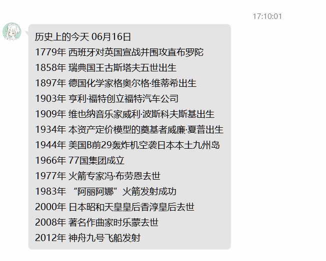

<div align="center">
  <a href="https://v2.nonebot.dev/store"></a>
  <br>
  <p></p>
</div>

<div align="center">

# nonebot-plugin-today-in-history

_✨ 历史上的今天 ✨_


<a href="./LICENSE">
    
</a>
<a href="https://pypi.python.org/pypi/nonebot-plugin-today-in-history">
    
</a>


</div>

## 📖 介绍

定时向指定群&好友发送  **历史上的今天**

数据源：[历史上的今天-百度百科](https://baike.baidu.com/calendar/)


- 推荐python`3.9+`

## 💿 安装

<details>
<summary>使用 nb-cli 安装</summary>
在 nonebot2 项目的根目录下打开命令行, 输入以下指令即可安装

    nb plugin install nonebot-plugin-today-in-history

</details>

<details>
<summary>使用包管理器安装</summary>
在 nonebot2 项目的插件目录下, 打开命令行, 根据你使用的包管理器, 输入相应的安装命令

    pip install nonebot-plugin-today-in-history


打开 nonebot2 项目根目录下的 `pyproject.toml` 文件, 在 `[tool.nonebot]` 部分追加写入

    plugins = ["nonebot_plugin_today_in_history"]

</details>


## ⚙️ 配置

在 nonebot2 项目的`.env`文件中添加下表中的必填配置

| 配置项 | 必填 | 默认值 |  说明 |
|:-----:|:----:|:----:|:----:|
| history_qq_groups_all | 否 | False | 开启全部群聊推送，为`True`时`history_qq_groups`失效 |
| history_qq_groups | 否 | [ ] | 列表形式，如[123,456] |
| history_qq_friends | 否 | [ ] | 列表形式，如[123,456] |
| history_inform_time | 否 | 7 35 | 每日推送时间，以空格隔开 |

说明，通过群聊/私聊添加的自定义配置优先于`.env`配置

上面的表格不会的可照抄下面的配置示例

```
# nonebot-plugin-today-in-history
history_qq_groups_all=False #开启全部群聊推送，为`True`时`history_qq_groups`失效
history_qq_friends=[123,456] #设定要发送的QQ好友
history_qq_groups=[123,456] #设定要发送的群
history_inform_time="7 35" #设定每天发送时间，以空格间隔
```

## 🎉 使用
### 指令表
| 指令  | 说明 |
|:-----:|:----:|
| 历史上的今天 | 查看今天的历史上的今天 |
| 历史上的今天+设置 | 以连续对话的形式设置历史上的今天的推送时间 |
| 历史上的今天+设置 小时:分钟 | 设置历史上的今天的推送时间 |
| 历史上的今天+状态 | 查看当前群聊/私聊的历史上的今天状态 |
| 历史上的今天+禁用 | 禁用当前群聊/私聊的历史上的今天推送 |

### 效果图



## 其他


- [bingganhe123/60s-](https://github.com/bingganhe123/60s-) ~~进行一个简单的抄~~

- [A-kirami/nonebot-plugin-moyu](https://github.com/A-kirami/nonebot-plugin-moyu) 提供的自定义配置代码块